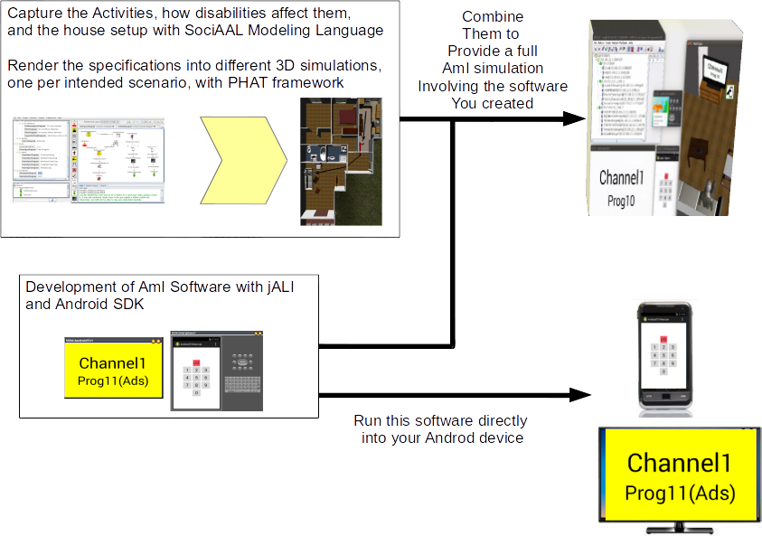

#Introduction

This site introduces the *Ambient Intelligence Development Environment* or **AIDE**. This is a software oriented towards the early development and rapid prototyping of AmI systems. It assumes the devices to be hosted by the environment are Android ones. Android devices have many forms today and can be assumed to play an important future in the Ambient Intelligence scenario. 

#Background

AIDE continues the idea of Virtual Living Lab as introduced in "*Pablo Campillo-Sanchez, Jorge J. Gómez-Sanz, Juan A. Botía: PHAT: Physical Human Activity Tester. HAIS 2013: 41-50*" and "*Pablo Campillo-Sanchez, Jorge J. Gómez-Sanz:Agent Based Simulation for Creating Ambient Assisted Living Solutions. PAAMS 2014: 319-322*". The purpose of **AIDE** is to reduce development costs while keeping, or increasing, the quality of the AmI software.

**AIDE** assumes the development of Ambient Assisted Living solutions is expensive for many reasons:

- A researcher needs important funding to start developing anything. A basic set of actuators and sensors plus the necessary APIs and SDKs can be over two thousand euros. If the researcher knows how to create such hardware, the price is lower, but, then, it is the researcher's time what is being spent. 

- There is an ongoing struggle for standardization. The interoperability of the solution with different vendors is an important issue that also affects the price.

- Field experiments are another source of expenses. Before reaching the end users, sufficiently thorough tests need to be performed with real people. This tests are usually performed either in a rented facility or in an previously equiped owned facility, in which case it is still an investment to account for. Besides, being humans involved in the loop, their privacy and safety needs to be assured. This means that not all tests are possible and measurements need to be further processed to anonymize the information.

Previous reasons, and others not listed here, prevent some people with very specific needs to have affordable AAL solutions that improve their quality of daily living. 

Our working hypothesis is that an inexpensive computer based simulation can reduce the amount of expenses by reproducing the AAL environment in a computer simulation that includes not only the inhabitants of the environment but the AmI system as well. This computer simulation is what we call **Virtual Living Lab**

#Benefits of the Virtual Living Lab approach

Virtual Living Labs is a concept still under evolution. The results we have now permit to  affirm the following: 

- It permits researchers to perform experiments as tough as required, without a concern of damaging the users or affecting their privacy
- Any kind of sensor or actuator can be reproduced and integrated in such environment without a previous investment in existing software
- Experiments are perfectly repeteable, so the creation of libraries of expected behaviors is possible. This reuse may potentially reduce the development costs of similar products by sharing the knowledge that a previous development acquired. Long term, this also will have the advantage of increasing the quality of the products, since the amount of testing and considered situations for specific or generic collectives will be greater each time. 
- For this to be a reality, the researcher must be able to develop indistinctly for this Virtual Living Lab and for the Real World. It is the **software in the loop** concept, that makes the same software run in the simulation to run in the real devices.

# Funding and Acknowledgements

We are always willing to participate in development projects, specially if they are already funded or have potential to be so. We are specially interested in those that allow us to hire more developers and make **AIDE** advance. 

Currently, **AIDE** will be reinforced with a new research project called Collaborative Ambient Assisted Living Design (ColoSAAL, TIN2014-57028-R) and  the european project (P2PValue)[http://www.p2pvalue.eu/]. The first will bring more advanced simulation capabilities, including anatomy of the patients, and will reuse results from the second to build collaborative multidisciplinary design tools for experts. 

This project combines number of results from different past research projects:

- Social Ambient Assisted Living (SociAAL - TIN2011-28335-C02-01). This project produced the PHAT framework, responsible of the 3D simulation, and the jALI/jDOS frameworks for connecting external Android Based devices to the simulation. More about this project at its site [http://grasia.fdi.ucm.es/sociaal](http://grasia.fdi.ucm.es/sociaal)

- INGENIAS (TIC2002-04516-C03-03),  INGENIAS 2 (TIN2005-08501-C03-01) provided the tools for model driven development. These tools were later on stabilized with SiCoSSys (TIN2008-06464-C03-01). The model driven tools were devised for supporting the INGENIAS Agent Oriented methodology [http://ingenias.sf.net](http://ingenias.sf.net). The result was the INGENME framework, which is available at [http://ingenme.sf.net](http://ingenme.sf.net)

The expected outcome of the project is twofold: first, a better understanding of what kind of AAL applications do Parkinson disease patients; second, an infrastructure that enables industry to create AAL solutions in a more efficient and less expensive way.  This project has the support of the [Parkinson Madrid](http://www.parkinsonmadrid.org/) association. 

The project has started with a sociological field study of the circumstances of Parkinson patients from an AAL perspective. Also, it is developing tools and techniques to better capture this information, as well as the means to transform this information into system applications. Another important contribution of this project is the concept of Virtual Living Lab, as an inexpensive, though realistic, testbed for developing AAL applications. Videos showing these concepts can be found in this site.

